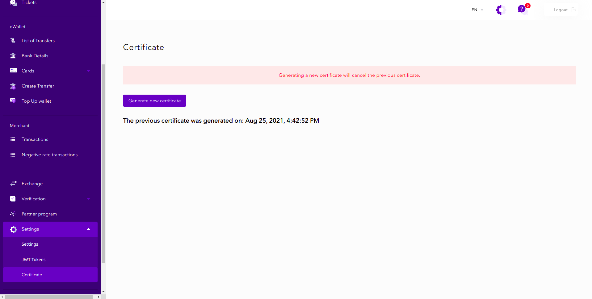

* [Back to contents](../Readme.md#contents)

# Transfer Between Wallets

* [Request payload encrypt/decrypt](#Request payload encrypt/decrypt)
* [Endpoint description](#endpoint-description)
* [Request example](#request-example)
* [Successful response example](#successful-response-example)

**Important!** To create a transfer between wallets request, you need to create a certificate and to [encrypt request payload](#request-payload-encryptdecrypt).
You can **download** your personal certificate in [your account](https://account.paydo.com/en/settings/certificate).




## Request payload encrypt/decrypt

While creating a request for transfer between wallets, you need to encrypt request payload with a personal certificate.
We are using popular encryption library to decrypt request payload - [Sodium](https://libsodium.gitbook.io/doc/).
In short, before sending a withdrawal request you have to make next steps:

* Encrypt request payload with [Sodium Sealed boxes](https://libsodium.gitbook.io/doc/public-key_cryptography/sealed_boxes#usage)
  (
  [Python](https://libnacl.readthedocs.io/en/latest/topics/raw_sealed.html),
  [PHP](https://www.php.net/manual/en/function.sodium-crypto-box-seal.php)
  ).
* Encode encrypted binary string with Base64.

Below you can see PHP example, how to encrypt request payload before sending a transfer between wallets request:

```php
// Original certificate file that was downloaded from the site (paydo.com). it's contains a binary string.
$certFilePath = '/project/x25519.pub';
// Certificate must be encoded as base64 string.
// You can use below example to encode it or use linux console command: cat /project/x25519.pub | base64 
$publicKeyCertificate = base64_encode(file_get_contents($certFilePath));
$data = [
    [
        'withdrawalId' => 173685f6-d0d7-54b6-a79c-2c272b5d72b7,
        'withdrawalSystemId' => 1132125f6-d0d7-54b6-a79c-2c272444417,
        'withdrawalSystemData' => [
            'method' => 204
        ],
        'method' => 15,
        'type' => 1,
        'amount' => 34,
        'currency' => 'USD',
        'additionalData' => [
            'direction' => 'direction one',
            'referenceId' => 'my.email@address.com'
        ]
    ]

$encryptedPayload = sodium_crypto_box_seal(json_encode($data), base64_decode($publicKeyCertificate));
// $encryptedPayload - it's a binary string
$base64Payload = base64_encode($encryptedPayload);
// $base64Payload - looks like 9kQ7v9nXLHjeOyIqi+hIJfEKuOCQZ2C5WWVcnmfPHUxh1EbK5g=
```

See more examples [here](../Examples/apiCertificates).

## Endpoint description

**Important!** This endpoint requires [authentication](../Authentication/authentication.md).

**Endpoint**:

    POST https://paydo.com//v1/wallets/move-money-between-wallets/withdraw

**Headers**:

    Content-Type: application/json
    Authorization: Bearer eyJ0eXAiO...

__For more detailed information visit our OpenApi [specification](https://paydo.com/en/open-api-specification/#/Wallet)__.
## Request example:

```shell script
curl -X POST \
  https://paydo.com//v1/wallets/move-money-between-wallets/withdraw \
    -H 'Content-Type: application/json' \
    -H 'Authorization: Bearer eyJ0eXAiOiJKV...' \
    -d '{"data": "l6v39G1mV+LZCc+gQs5AqVnK7..."}'
```    

## Successful response example:
Response Headers
```
HTTP/1.1 200 OK
Content-Type: application/json
identifierTxFrom: 173685f6-d0d7-54b6-a79c-2c272b5d72b7
identifierTxTo: bbbf19ff-eaad-4ccf-aa8c-c69d60aaceb0
```

Response Body
```json
{
    "data": [],
    "status": 1
}
```
